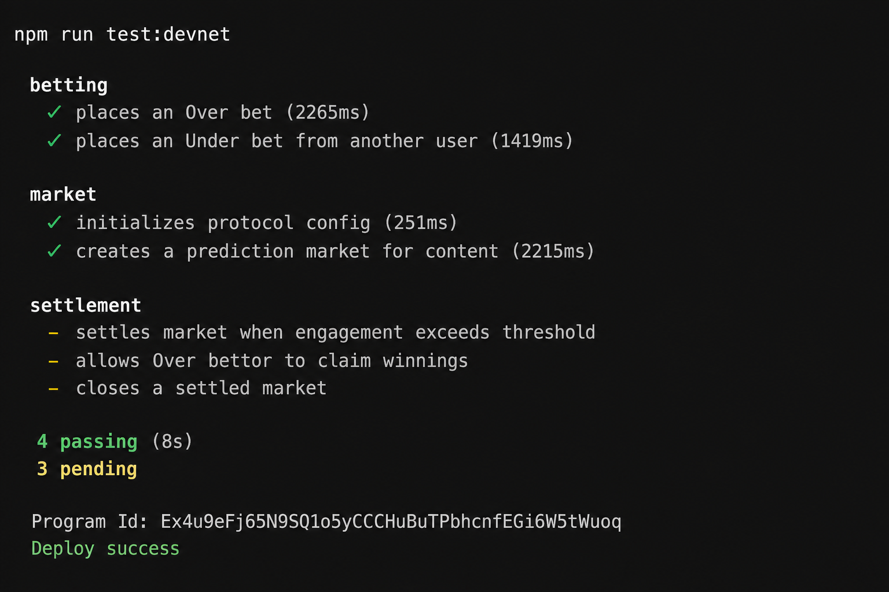
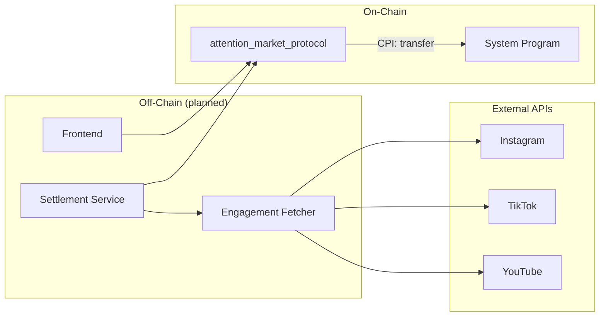

# Reelify — Attention Market Protocol

An on-chain prediction market on Solana where users stake SOL on whether short-form content will finish **over** or **under** an engagement threshold by a deadline. Markets cover Instagram Reels, TikToks, and YouTube Shorts.

---

## Capstone Submission

| Requirement | Status |
| ----------- | ------ |
| Program deployed to devnet | ✅ |
| Passing test suite on devnet | Run `npm run test:devnet` |
| Devnet Program ID in README | See below |
| Test screenshot in README | Add after running tests |
| Frontend on devnet | ✅ React UI + wallet adapter |

### Devnet Program ID

```
Ex4u9eFj65N9SQ1o5yCCCHuBuTPbhcnfEGi6W5tWuoq
```

Explorer: https://explorer.solana.com/address/Ex4u9eFj65N9SQ1o5yCCCHuBuTPbhcnfEGi6W5tWuoq?cluster=devnet

### Deploy & test on devnet

```bash
# 1. Point Solana CLI at devnet and fund wallet
solana config set --url devnet
solana airdrop 2   # repeat if needed

# 2. Build and deploy
npm run deploy:devnet

# 3. Run full test suite against devnet
npm run test:devnet
```

### Devnet test results

Run tests and add a screenshot to the repo:

```bash
npm run test:devnet
# Screenshot the terminal output, save as docs/devnet-tests.png
```

Then uncomment the image line below:

<!--  -->

### Frontend (devnet)

```bash
cd app/frontend
cp .env.exmaple .env.local   # already points at devnet
npm install
npm run dev
```

1. Connect Phantom/Solflare (network: **Devnet**)
2. Go to **Demo Setup** → **Seed all demo markets**
3. Browse markets → place Over/Under bets with devnet SOL

---

## How It Works

1. **Bootstrap** — A protocol admin calls `initialize_config` once to set the fee and authority.
2. **Create market** — A creator opens a market for a piece of content with a threshold (e.g. 100,000 views) and deadline.
3. **Place bets** — Bettors stake SOL on **Over** or **Under**; lamports move into a market vault PDA.
4. **Settle** — After the deadline, the protocol authority submits `settle_market` with observed engagement. Over wins if `final_engagement >= threshold`.
5. **Claim** — Winners call `claim_reward` to receive their stake plus a proportional share of the losing pool (minus protocol fee).
6. **Close** — The authority calls `close_market` to close the market account and return rent to the creator.

```
Open ──place_bet──▶ Open ──settle_market──▶ Settled ──claim_reward──▶ Settled ──close_market──▶ Closed
```

---

## Architecture



| Layer | Component | Role |
| ----- | --------- | ---- |
| On-chain | `attention_market_protocol` | Market lifecycle, bet escrow, settlement, payouts |
| On-chain | System Program | SOL transfers (bet → vault, vault → winner) |
| Off-chain | Engagement Fetcher | Poll social APIs, cache engagement snapshots |
| Off-chain | Settlement Service | Read oracle data, submit `settle_market` as authority |
| Off-chain | Frontend | Wallet connection, market discovery, bet/claim UI |

See [docs/architecture.md](./docs/architecture.md) for full diagrams, CPI matrix, and error paths.

---

## Project Structure

```
attention-market-protocol/
├── programs/attention-market-protocol/
│   └── src/
│       ├── instructions/       # initialize_config, initialize_market, place_bet, ...
│       ├── state/              # Config, Market, Bet account structs
│       ├── errors.rs
│       ├── constants.rs
│       └── lib.rs
├── tests/
│   ├── helpers.ts              # PDA helpers, shared test setup
│   ├── market.test.ts          # Config + market creation
│   ├── betting.test.ts         # place_bet flows
│   └── settlement.test.ts      # settle, claim, close
├── app/
│   ├── frontend/               # React frontend (Solana wallet + bet UI)
│   └── api/                    # engagement-fetcher, settlement-service (placeholder)
├── docs/
│   ├── architecture.md         # Full protocol architecture
│   ├── diagrams.md             # Standalone Mermaid diagrams
│   └── user-flows.md           # Step-by-step user journeys
├── target/
│   ├── idl/                    # Generated IDL (after build)
│   └── types/                  # Generated TypeScript types (after build)
├── Anchor.toml
└── package.json
```

---

## Prerequisites

| Tool | Version | Install |
| ---- | ------- | ------- |
| Rust | stable | [rustup.rs](https://rustup.rs/) |
| Solana CLI | latest | [Solana docs](https://docs.solanalabs.com/cli/install) |
| Anchor | 0.32+ | [Anchor installation](https://www.anchor-lang.com/docs/installation) |
| Node.js | 18+ | [nodejs.org](https://nodejs.org/) |
| Yarn | 1.x+ | `npm install -g yarn` |

---

## Getting Started

### 1. Clone and install dependencies

```bash
git clone <repo-url>
cd attention-market-protocol
yarn install
```

### 2. Configure Solana for local development

```bash
solana config set --url localhost
solana-keygen new   # skip if you already have ~/.config/solana/id.json
```

### 3. Build the program

```bash
anchor build
```

This compiles the Anchor program and generates the IDL at `target/idl/attention_market_protocol.json` and TypeScript types at `target/types/attention_market_protocol.ts`.

### 4. Run tests

```bash
anchor test
```

`anchor test` starts a local validator, deploys the program, and runs the Mocha test suite in `tests/`.

### 5. Lint (optional)

```bash
yarn lint        # check formatting
yarn lint:fix    # auto-fix with Prettier
```

---

## Program

**Program ID (devnet):** `Ex4u9eFj65N9SQ1o5yCCCHuBuTPbhcnfEGi6W5tWuoq`

Configured in `Anchor.toml` and `programs/attention-market-protocol/src/lib.rs`.

### Instructions

| Instruction | Caller | Description |
| ----------- | ------ | ----------- |
| `initialize_config` | Admin | One-time bootstrap: set protocol authority and fee (basis points) |
| `initialize_market` | Creator | Create a prediction market for a content ID + platform |
| `place_bet` | Bettor | Stake SOL on Over or Under; creates a Bet PDA |
| `settle_market` | Authority | Record `final_engagement` and determine outcome |
| `claim_reward` | Winner | Claim stake + proportional share of losing pool |
| `close_market` | Authority | Close settled market; rent returned to creator |

### Supported Platforms

| Platform | Enum variant |
| -------- | ------------ |
| Instagram | `Platform::Instagram` |
| TikTok | `Platform::TikTok` |
| YouTube | `Platform::YouTube` |

### Account Model

| Account | Seeds | Owner | Key Fields |
| ------- | ----- | ----- | ---------- |
| **Config** | `["config"]` | AMP | `authority`, `fee_bps`, `total_markets` |
| **Market** | `["market", content_id, platform_byte]` | AMP | `creator`, `platform`, `content_id`, `engagement_threshold`, `deadline`, `total_over`, `total_under`, `status`, `outcome`, `final_engagement` |
| **Bet** | `["bet", market, user]` | AMP | `side`, `amount`, `claimed` |
| **Vault** | `["vault", market]` | System Program | Lamports only (escrow) |

`content_id` is a string up to 64 bytes (URL hash, post ID, etc.).

### Fee Model

Protocol fee is deducted from the **losing pool** before distribution:

```
fee           = losing_pool × fee_bps / 10_000
distributable = losing_pool - fee
share         = distributable × (bet.amount / winning_pool)
payout        = bet.amount + share
```

**Example:** 1 SOL on Over, 1 SOL on Under, Over wins, 2% fee (`fee_bps = 200`):

- `fee = 0.02 SOL`, `distributable = 0.98 SOL`
- Winner payout = `1.0 + 0.98 = 1.98 SOL`

### On-Chain Errors

| Error | When |
| ----- | ---- |
| `InvalidContentId` | Content ID empty or longer than 64 bytes |
| `InvalidFee` | `fee_bps` exceeds 10,000 |
| `InvalidThreshold` | Engagement threshold is zero |
| `InvalidDeadline` | Deadline is not in the future |
| `ZeroBetAmount` | Bet amount is zero |
| `MarketNotOpen` | Market is not open for betting |
| `MarketExpired` | Deadline has passed |
| `MarketNotSettled` | Claim or close before settlement |
| `MarketAlreadySettled` | Attempt to settle twice |
| `VaultNotEmpty` | Close while vault still holds lamports |
| `AlreadyClaimed` | Bet already claimed |
| `NotWinningBet` | Loser attempts to claim |
| `Unauthorized` | Non-authority calls settle/close |
| `Overflow` | Arithmetic overflow |

---

## Testing

The test suite covers the full market lifecycle:

| File | Coverage |
| ---- | -------- |
| `tests/market.test.ts` | `initialize_config`, `initialize_market` |
| `tests/betting.test.ts` | `place_bet` (Over/Under, validation) |
| `tests/settlement.test.ts` | `settle_market`, `claim_reward`, `close_market` |

Shared helpers in `tests/helpers.ts` provide PDA derivation, config bootstrap, and funded keypair utilities.

```bash
# Local (starts validator + deploys)
anchor test

# Devnet (program must already be deployed)
npm run test:devnet

# Run a single file (validator must already be running)
yarn run ts-mocha -p ./tsconfig.json -t 1000000 tests/market.test.ts
```

---

## Client Integration

After `anchor build`, import the generated types:

```typescript
import { Program } from "@coral-xyz/anchor";
import { AttentionMarketProtocol } from "./target/types/attention_market_protocol";

const program = anchor.workspace.AttentionMarketProtocol as Program<AttentionMarketProtocol>;

// Derive PDAs
const [config] = PublicKey.findProgramAddressSync(
  [Buffer.from("config")],
  program.programId
);

const [market] = PublicKey.findProgramAddressSync(
  [Buffer.from("market"), Buffer.from(contentId), Buffer.from([platformByte])],
  program.programId
);
```

See `tests/helpers.ts` for complete PDA derivation and instruction examples.

---

## Documentation

| Document | Description |
| -------- | ----------- |
| [docs/architecture.md](./docs/architecture.md) | Program structure, account mapping, CPI matrix, integrations, error paths |
| [docs/diagrams.md](./docs/diagrams.md) | Standalone Mermaid diagrams (system context, lifecycle, sequences) |
| [docs/user-flows.md](./docs/user-flows.md) | Step-by-step user journeys for each role |
| [app/frontend/README.md](./app/frontend/README.md) | Planned frontend structure |
| [app/api/README.md](./app/api/README.md) | Planned off-chain services |

---

## Roadmap

- [ ] Engagement oracle integration (Instagram / TikTok / YouTube APIs)
- [x] Frontend with Solana wallet adapter (Phantom, Solflare)
- [ ] SPL token support for betting
- [ ] Market discovery indexing (Helius / custom indexer)
- [ ] Multi-oracle settlement registry
- [ ] Creator revenue share on protocol fees

---

## Tech Stack

| Component | Technology |
| --------- | ---------- |
| On-chain program | Rust, Anchor 0.32.1 |
| Tests | TypeScript, Mocha, Chai |
| Tooling | Anchor CLI, Solana CLI, Prettier |

---

## License

ISC
