# Reelify — Attention Market Protocol Architecture

## Overview

Reelify is an on-chain prediction market protocol on Solana where users stake SOL on whether
a piece of short-form content will exceed (or fall below) an engagement threshold by a
deadline. This document maps program structure, accounts, CPIs, external integrations,
user flows, and error paths per Solana protocol architecture standards.

---

## Legend

| Symbol / Color | Meaning |
| -------------- | ------- |
| Blue box | On-chain Anchor program |
| Green box | Program-owned account (PDA) |
| Yellow box | User-owned account (signer / wallet) |
| Gray cylinder | Off-chain database / indexer |
| Cloud shape | External API service |
| Hexagon | Oracle / settlement authority |
| Solid arrow | Instruction call or control flow |
| Dashed arrow | Off-chain / async data flow |
| Diamond | Decision point |

---

## 1. Program Structure Visualization

Reelify v1 ships as a **single Anchor program** with six instructions. Off-chain services
handle engagement data fetching and settlement submission. Future versions may split into
separate programs (e.g. oracle registry, SPL token vault).

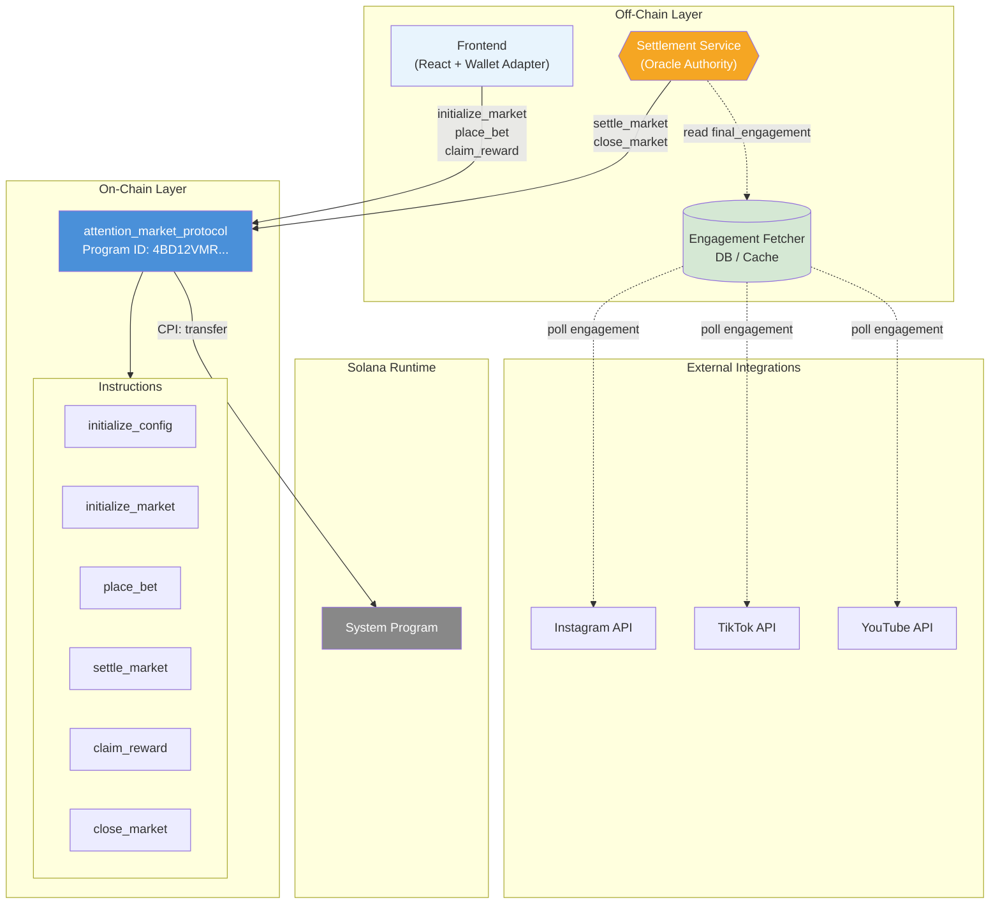

### Program Responsibilities

| Component | Responsibility |
| --------- | -------------- |
| `attention_market_protocol` | Market lifecycle, bet escrow, settlement logic, reward distribution |
| System Program | SOL transfers (user → vault on bet, vault → user on claim) |
| Engagement Fetcher | Polls social APIs, stores engagement snapshots |
| Settlement Service | Reads oracle data, submits `settle_market` as protocol authority |
| Frontend | Wallet connection, market discovery, bet placement, claim UI |

### Instruction → CPI Matrix

| Instruction | CPI Target | CPI Operation | Direction |
| ----------- | ---------- | ------------- | --------- |
| `place_bet` | System Program | `transfer` | User wallet → Vault PDA |
| `claim_reward` | System Program | `transfer` (PDA signer) | Vault PDA → User wallet |
| All `init` instructions | System Program | Account creation (via Anchor) | Payer → new accounts |

No cross-program invocations to SPL Token or Metaplex in v1. SOL-only escrow.

---

## 2. Account Structure Mapping

### Account Hierarchy

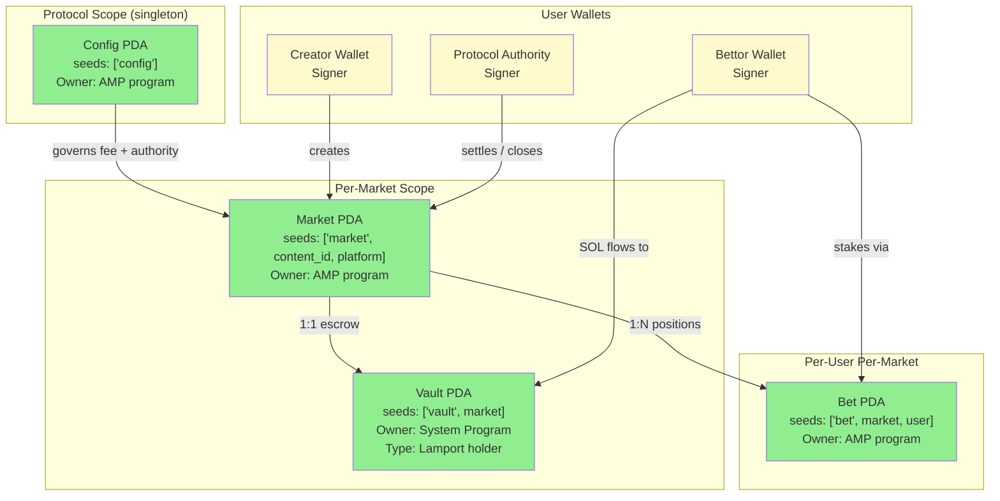

### Account Detail Table

| Account | Type | Owner | Seeds | Primary Data |
| ------- | ---- | ----- | ----- | ------------ |
| **Config** | PDA | AMP | `["config"]` | `authority`, `fee_bps`, `total_markets`, `bump` |
| **Market** | PDA | AMP | `["market", content_id, platform_byte]` | `creator`, `platform`, `content_id`, `engagement_threshold`, `deadline`, `total_over`, `total_under`, `status`, `outcome`, `final_engagement`, bumps |
| **Bet** | PDA | AMP | `["bet", market, user]` | `market`, `user`, `side`, `amount`, `claimed`, `bump` |
| **Vault** | PDA | System Program | `["vault", market]` | Lamports (escrowed SOL) |
| **User Wallet** | Signer | User | — | SOL balance, transaction signer |

### PDA Derivation Flow

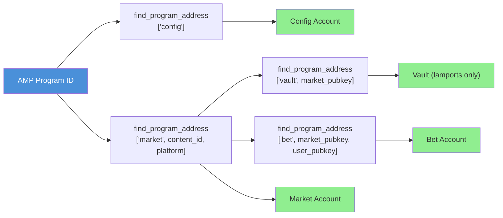

### Market State Machine

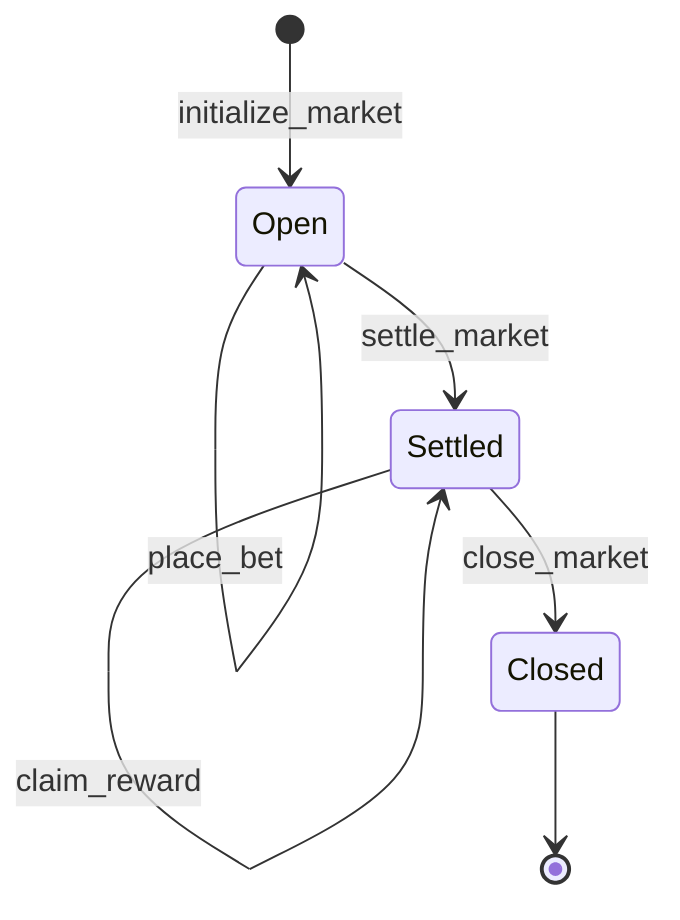

---

## 3. External Dependencies and Integrations

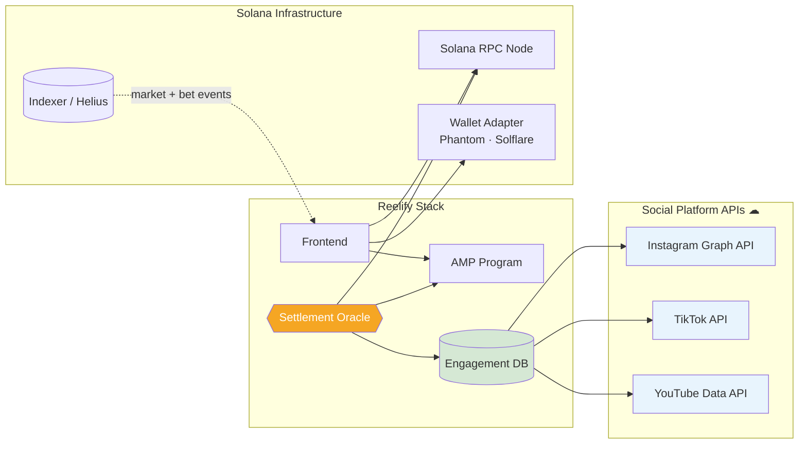

| Integration | Shape | Role | Connection Point |
| ----------- | ----- | ---- | ---------------- |
| Instagram / TikTok / YouTube APIs | Cloud | Engagement data source | Engagement Fetcher polls on interval |
| Engagement DB | Cylinder | Cached metrics, historical snapshots | Settlement Service reads at deadline |
| Settlement Oracle | Hexagon | Trusted authority for `settle_market` | Signs with Config.authority key |
| Solana RPC | Cloud | Transaction submission | Frontend + Settlement Service |
| Indexer | Cylinder | Market discovery, bet history | Frontend read path |

---

## 4. User Interaction Flows

### 4a. Market Creation (Creator)

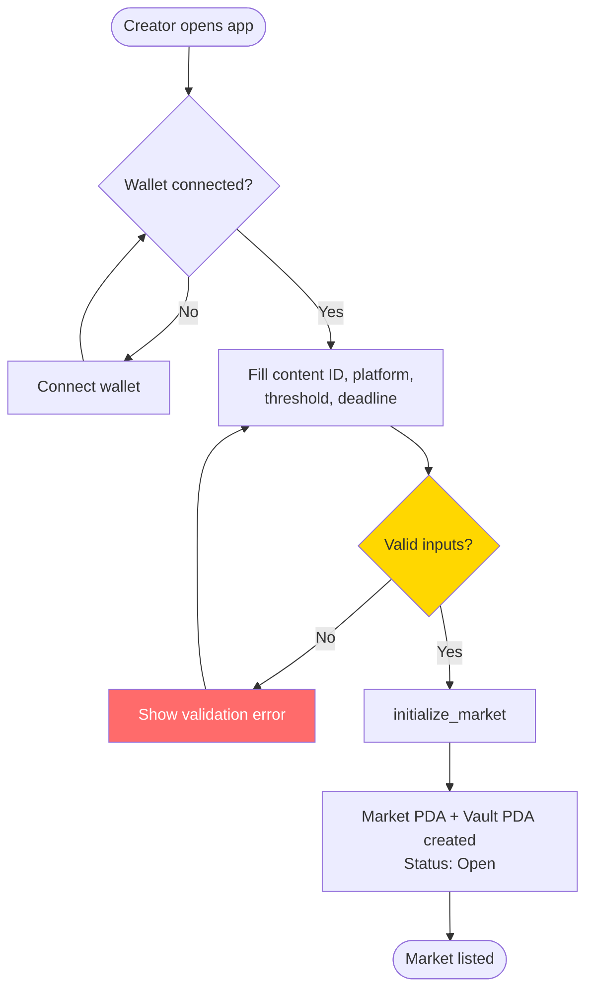

### 4b. Bet Placement (Bettor)

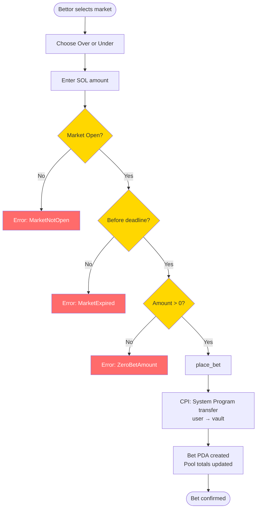

### 4c. Settlement and Reward Claim

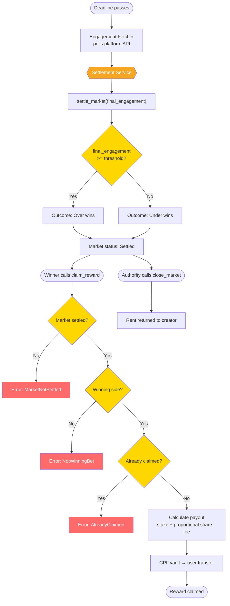

---

## 5. End-to-End Sequence Diagram

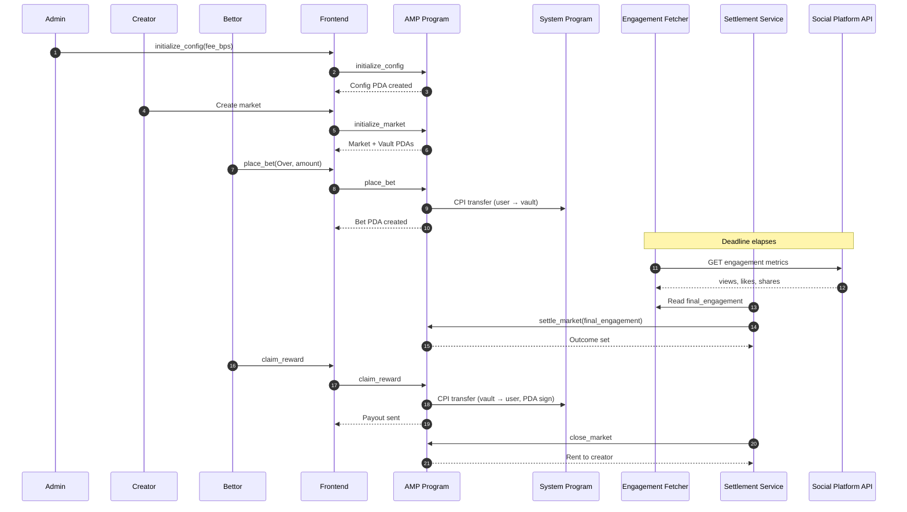

---

## 6. Program Interaction Matrix

| Caller | Instruction | Accounts Read | Accounts Written | CPI | Auth Required |
| ------ | ----------- | ------------- | ---------------- | --- | ------------- |
| Admin | `initialize_config` | — | Config (init) | System (create) | Admin signer |
| Creator | `initialize_market` | Config | Config, Market (init) | System (create) | Creator signer |
| Bettor | `place_bet` | Market | Market, Bet (init), Vault | System (transfer) | Bettor signer |
| Authority | `settle_market` | Config, Market | Market | — | Config.authority |
| Winner | `claim_reward` | Config, Market, Bet | Bet, Vault | System (transfer) | Bettor signer |
| Authority | `close_market` | Config, Market | Market (close) | — | Config.authority |

### Data Flow Summary

```
place_bet:    User SOL ──CPI──▶ Vault PDA        | Market.total_over/under ↑
settle_market: final_engagement ──▶ Market.outcome, status
claim_reward:  Vault PDA ──CPI──▶ User SOL       | Bet.claimed = true
close_market:  Market rent ──▶ Creator wallet
```

---

## 7. Account Management Lifecycle

```mermaid
flowchart LR
    subgraph CREATE["Account Creation"]
        C1["initialize_config → Config PDA"]
        C2["initialize_market → Market PDA"]
        C3["place_bet → Bet PDA"]
        C4["Vault PDA (implicit, lamport-only)"]
    end

    subgraph UPDATE["State Updates"]
        U1["place_bet → total_over / total_under"]
        U2["settle_market → outcome, status, final_engagement"]
        U3["claim_reward → bet.claimed = true"]
    end

    subgraph CLOSE["Account Closure"]
        X1["close_market → Market closed, rent to creator"]
        X2["Bet accounts persist until manual close (future)"]
    end

    CREATE --> UPDATE --> CLOSE
```

| Event | Account | Action | Rent Payer |
| ----- | ------- | ------ | ---------- |
| Protocol bootstrap | Config | `init` | Admin |
| Market creation | Market | `init` | Creator |
| First bet on market | Vault | receives lamports | — |
| Each bet | Bet | `init` | Bettor |
| Settlement | Market | mutate | — |
| Claim | Bet, Vault | mutate + transfer | — |
| Close | Market | `close` | Creator receives rent |

---

## 8. Error Paths and Decision Points

All on-chain errors are defined in `errors.rs`:

| Error | Trigger Point | User Impact |
| ----- | ------------- | ----------- |
| `InvalidContentId` | `initialize_market` | Transaction reverts |
| `InvalidFee` | `initialize_config` | Transaction reverts |
| `InvalidThreshold` | `initialize_market` | Transaction reverts |
| `InvalidDeadline` | `initialize_market` | Transaction reverts |
| `ZeroBetAmount` | `place_bet` | Transaction reverts |
| `MarketNotOpen` | `place_bet`, `settle_market` | Transaction reverts |
| `MarketExpired` | `place_bet` | Transaction reverts |
| `MarketNotSettled` | `claim_reward`, `close_market` | Transaction reverts |
| `AlreadyClaimed` | `claim_reward` | Transaction reverts |
| `NotWinningBet` | `claim_reward` | Loser cannot claim |
| `Unauthorized` | `settle_market`, `close_market` | Non-authority rejected |
| `Overflow` | Any arithmetic | Transaction reverts |

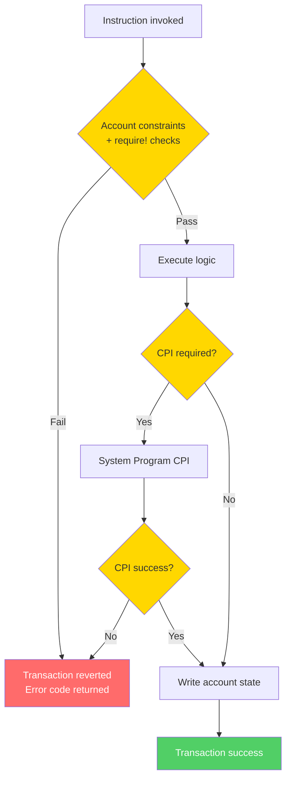

---

## 9. Fee Model

Protocol fee (`fee_bps`) is deducted from the **losing pool** before distribution:

```
fee          = losing_pool × fee_bps / 10_000
distributable = losing_pool - fee
share         = distributable × (bet.amount / winning_pool)
payout        = bet.amount + share
```

Example: 1 SOL on Over, 1 SOL on Under, Over wins, 2% fee:
- `fee = 0.02 SOL`, `distributable = 0.98 SOL`
- Winner payout = `1.0 + 0.98 = 1.98 SOL`

---

## 10. Future Architecture (v2 Roadmap)

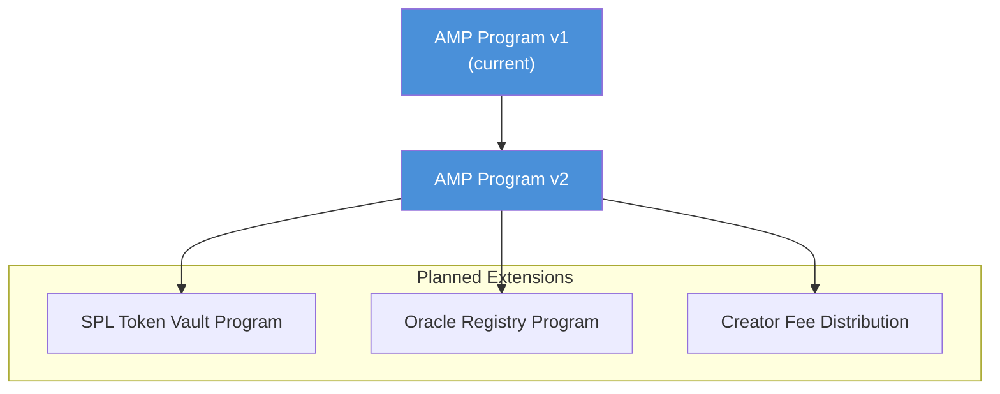

| Extension | Description |
| --------- | ----------- |
| SPL token betting | Replace SOL vault with token vault CPI to SPL Token program |
| Multi-oracle settlement | Oracle registry program with weighted engagement sources |
| Creator revenue share | Fee split to content creator wallet on settlement |
| Indexer integration | Real-time market feed via Helius / custom Geyser plugin |

---

## 11. Architecture Checklist

| Criterion | Status |
| --------- | ------ |
| All programs represented | ✅ AMP program + System Program CPI |
| Account structures mapped | ✅ Config, Market, Bet, Vault PDAs |
| Program interactions illustrated | ✅ CPI matrix + sequence diagram |
| External dependencies shown | ✅ Social APIs, oracle, RPC, indexer |
| Decision points included | ✅ Settlement, claim, validation flows |
| Error paths documented | ✅ Full error table + revert flow |
| Clear, consistent labeling | ✅ Legend + instruction labels on arrows |
| PDA derivation shown | ✅ Seed diagram |
| State machine documented | ✅ Open → Settled → Closed |
| Off-chain services mapped | ✅ Fetcher, settlement, frontend |

---

## File Reference

```
programs/attention-market-protocol/src/
├── instructions/
│   ├── initialize_market.rs   # initialize_config + initialize_market
│   ├── place_bet.rs
│   ├── settle_market.rs
│   ├── claim_reward.rs
│   └── close_market.rs
├── state/
│   ├── config.rs
│   ├── market.rs
│   └── bet.rs
├── errors.rs
├── constants.rs
└── lib.rs
```

Program ID (localnet): `4BD12VMRQiPgG8dtvW2BaMgZW2QiVzG9CESRHGGP9u1j`
