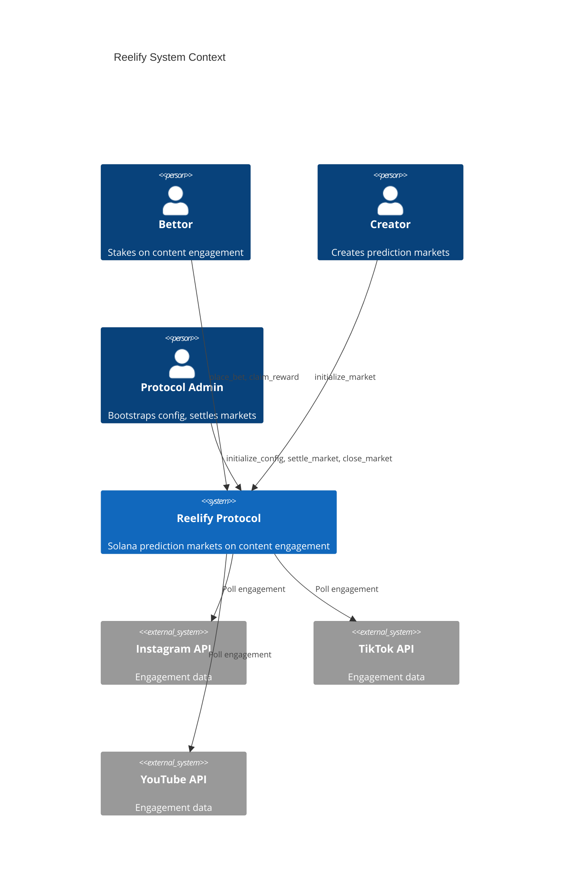
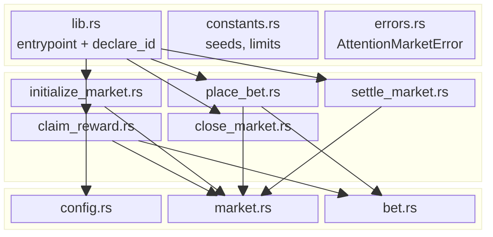
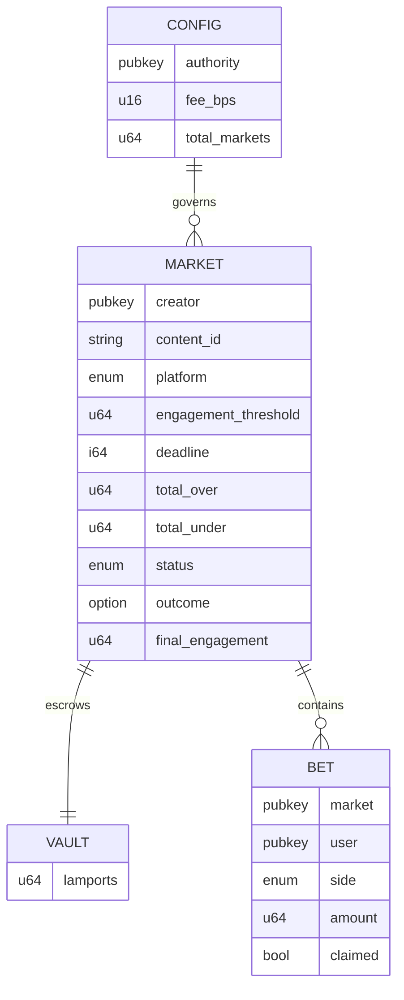
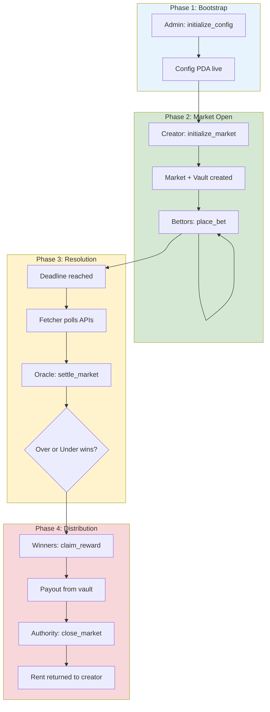
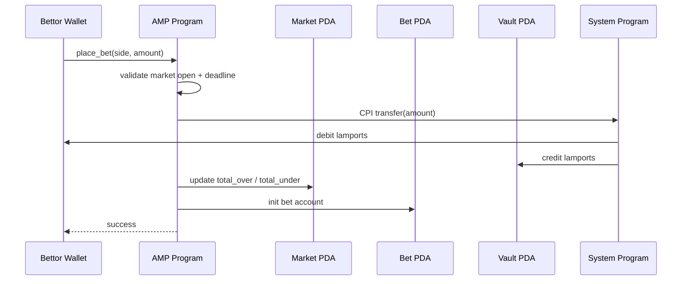
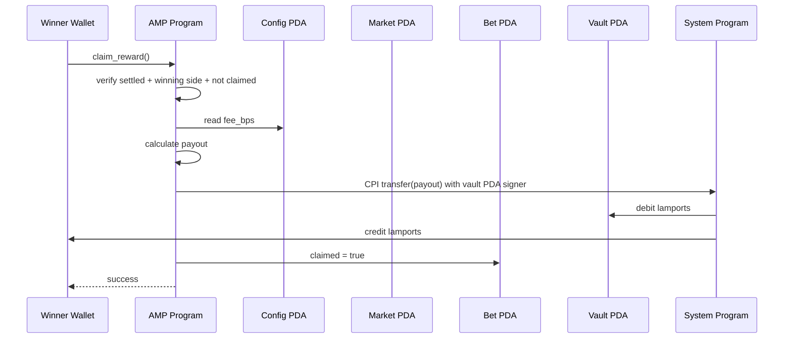

# Reelify Architecture Diagrams

Standalone Mermaid diagrams for the Attention Market Protocol. Render in GitHub,
VS Code (Markdown Preview Mermaid Support), or [mermaid.live](https://mermaid.live).

> Full narrative and tables: [architecture.md](./architecture.md)

---

## System Context

---

## Program Module Map

---

## Account Relationship (ER-style)

---

## Complete Lifecycle Flowchart

---

## CPI Detail: place_bet

---

## CPI Detail: claim_reward

---

## Rendering Tips

| Tool | How to use |
| ---- | ---------- |
| **GitHub** | Push to repo; Mermaid renders in `.md` files automatically |
| **VS Code** | Install "Markdown Preview Mermaid Support" extension |
| **mermaid.live** | Paste diagram code for PNG/SVG export |
| **Draw.io** | Import Mermaid or redraw for presentation slides |
| **Figma** | Use as reference for polished design system diagrams |
